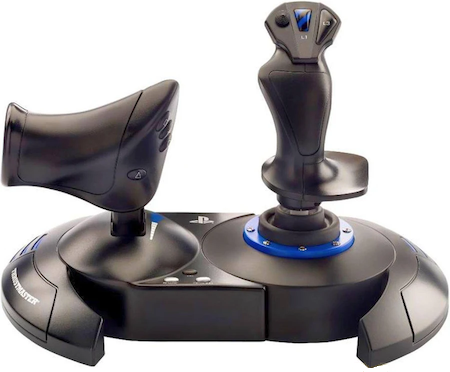

Repair of Thrustmaster T.Flight HOTAS 4 Joystick Drift
==============================================================================
&copy; 2026 by Tony Fabris

Problem: When playing games with this joystick, the input might "drift", failing to do the right thing when you return the stick to center. An example would be in flight simulator or space simulator games: It is expected that when you let go of the stick, your vehicle should fly straight, but if you are encountering this problem, your craft will drift in a sideways direction when you release the stick. 

One solution is to go into the game's configuration screens and set the "Dead Zone" settings to compensate. However this reduces the sensitivity of the stick during gameplay, thus reducing the benefits of using the HOTAS in the first place. To get the full joy out of the stick, so to speak, you can fix the stick itself, allowing you to turn off the "dead zone" settings.

> &#x24D8; ***Note:*** These instructions are for a years-old Thrustmaster, circa 2018-2020. It's possible that newer iterations of this stick will have production differences. Follow these instructions with care and make sure that the stick you're repairing matches what these instructions show.

Confirm the Issue 
-----------------

### At the same time, also ensure drivers and firmware are installed and updated

First, you need to confirm that you're having this specific problem in the first place. Get these Windows drivers and utility:

- Go to this page: https://support.thrustmaster.com/en/product/tflighthotas4-en/
- On that page, find the download named "Drivers - Package 2020_TFHT_5 + Firmware" and download it.
- Install it onto a Windows computer (a Mac running Parallels also works).
- It will install the latest device drivers, and two utility programs, for the stick.
- Plug your HOTAS into the PC's USB port.
- Open the Windows Start Menu and locate the "Thrustmaster TM Flight Series" folder in the Start menu. You should see the two utility programs there in that menu.
- Run "Firmware Update" from that folder in the Start menu, make sure your joystick is updated to the latest firmware.
- Once it's updated to the latest firmware, close the Firmware Update program.
- Run "Control Panel" from that folder in the Start menu and you should be able to see the joystick and press the "Properties" button.
- It should bring up a panel that looks like this:

- Check the stick movement and the screen diagrams. All of the analog axes should be smooth, and should return to absolute dead center when you release the controls and return them to center. They should never be jumpy, flickery, or drifty.
- Also check all buttons and all directions of the hat switch to make sure they work correctly in the control panel as well. Pressing a button should register a solid contact without noise or flickering.
- If those things are flickery, instead of smooth and solid, then you have the problem.

In particular, the ones that I had the most trouble with were the twist function, and the joystick X/Y axes. I also had trouble with one of the four buttons that make up the hat switch. If those are jittery or drifty, it means their contacts need to be cleaned or replaced. Once they've been cleaned or replaced, everything should be rock steady, and you should be able to plug it back in and set your "dead zone" settings back down to absolute zero.

------------------------------------------------------------------------------

Cleaning or replacing the X/Y axis potentiometers:
--------------------------------------------------

- Confirm if you are having this problem by using the utility control panel as described above.
- Unplug the joystick from the console or computer.
- Open bottom panel of the joystick.
- When disassembling, pay careful attention to where all the wires go, so that you remember them when reassembling. In particular, watch the way that the throttle cord enters the unit under the rectangular retainer piece which holds it.
- NOTE: there is a hidden screw under one of the rubber foot pads, inside the rectangular retainer piece, next to the long black screw where the throttle cord enters the unit. It is marked in the following illustration.

- Loosen the white joystick "base" assembly with the four obvious silver screws and lift it out. Note: You do not need to disassemble the handle to do this, you don't need to lift it out very far to get the potentiometers out. Gently pull out both of the axis potentiometers as shown in this illustration:

If cleaning:
- Squirt isopropyl alcohol, or [electronics contact cleaner](https://www.amazon.com/s?k=electronics+potentiometer+cleaner), into both of the potentiometers from the back side, soak them pretty good, as shown in this illustration. I try to put some into the central and side openings with some squirting pressure to make sure it goes all the way around the circuit board and gets to the contacts:

- Rotate each potentiometer shaft fully to the left and right several times while the cleaner is still wet.
- Dry up the excess cleaner with a tissue and let the thing sit and dry for a while.

If Replacing:
- See footnote at the bottom of this document for the part number, specifications, and wiring.

Reassembly:

- Return the potentiometers to their center position before re-inserting into the base assembly. They have a "keyed" shaft (d-shaped) and this key must fit into the correct position into the base assembly in order to work.
- Gently re-insert the potentiometers into the base assembly.
- Return the base assembly, and screw it back into position, BEING VERY CAREFUL NOT TO CRUSH ANY WIRES.
- Remember to put all wires carefully back into their original positions.
- Reassemble the base, BEING VERY CAREFUL NOT TO CRUSH ANY WIRES.
- When reassembling the base, make sure that the throttle cord gets back to where it was originally. It is held in place by a separate rectangular piece, where the long black screw goes.
- When reassembling the base, consider maybe not using as many screws on reassembly, just in case you want to get into it again. I don't bother reassembling the two small black screws, the hidden silver screw, or four of the medium screws. My reassembly uses only three screws: The long black screw, and two strategically-positioned medium black screws.

Test:

- Plug the joystick back into the Windows PC and run the control panel utility. You should see that the X/Y axes are dead-steady and perfectly centered now. No more flickering and drifting.
- Plug the joystick back in to your console or gaming PC, run your game, and set your dead zones back down to zero. You should have much better performance now.

------------------------------------------------------------------------------

Cleaning or replacing the twist function potentiometer:
-------------------------------------------------------

- There is a potentiometer for the twist function, inside the joystick handle, which can be cleaned or replaced the same way.
- Disassembling and reassembling the joystick handle is trickier, though: very hard to get back together right, without crushing wires, breaking wires off of their contact pads, messing up the twist function's tension spring, or messing up the twist function's retainer/disabler clip feature. Much caution has to be used when disassembling and reassembling.
- Because the disassembly/reassembly of the handle is so tricky, if your twist function isn't behaving "very" badly, ***I recommend just bumping up its dead zone in the game and not trying to work on it directly.***
- But if you want to give it a shot, here's the details below.

Handle disassembly:

- Unplug the joystick from the computer or console.
- Before removing the four illustrated screws, note the position of the small black plastic clip. This clip is the one which can be twisted with a flathead screwdriver in order to "disable" the twist function. Make sure the clip is in the "enable" position (i.e., the twist function is working), then leave the clip in place during this procedure.

- Once inside, note that there is no straightforward way to get the wires disconnected so that all parts can be laid down. Usually, half of the joystick handle will be dangling by its wires. Use extreme care not to break the wires by tugging on them.
- In particular, be very careful of the two brown wires running to the R3 button on the top right corner of the joystick. These are exceptionally fragile and may come off easily, requring a resoldering before you can reassemble the joystick.
- While working on this, try to leave the illustrated tension spring, and the twist function disabler clip, in their original places.
- Note the bracket which holds the the potentiometer in place. Keep this in mind when you get to the reassembling part.

If cleaning:
- Clean the potentiometer by squirting isopropyl alcohol, or electronics contact cleaner, into its interior, using the same technique as the X/Y potentiometers above. Make sure to get it inside the potentiometer, past the circuit board, where it can do some good. Then move it through its full range of motion several times to fully sweep the contacts.

If replacing:
- Same potentiometer as the joystick X/Y axes as described above. See footnote at the bottom of this document for the part number and specifications.

Buttons:

- If the buttons need to be worked on (based on testing with the control panel utility), now would be the time to do it, if you're up to the task. 
- I don't have detailed instructions for working on the buttons, unfortunately. You have to be good with a soldering iron and good with the mechanical side of electronics work to be successful here. This is the kind of thing where you already know you're good at this sort of thing, or you're not.
- One option would be to source new buttons and solder them in place. See footnotes below for part information.
- For the ones that I was unable to source, I was able to do the following. It required magnification and extreme care, and I recommend against this:
  - Desolder and dismantle the troublesome button, clean its tiny interior parts with isopropyl, and reassemble it (a tiny careful amount of cyanoacrylate was needed to reassemble the button so that its casing held together yet the button still worked). I recommend against this procedure, unless you're used to doing this kind of very tiny and iffy hack.

Reassembly:

- Ensure the twist potentiometer is back in its center position.
- Ensure that the tension spring is still in its original position.
- Ensure that the black clip which disables the twist function is in its original position, and it is set in the "enable" position.
- Place the left side of the handle onto the shaft as illustrated, carefully keeping the tension spring in place so that it goes into its slot.
- Test to make sure that the left half of the joystick can be twisted on the shaft and that the tension spring is functioning correctly.

- This is the hard part.
- Make sure all of the wires in the upper part of the joystick handle are clear of the screw holes and the trigger button.
- Make sure all of the wires are in a position that will be safe, not crushed or broken by reassembly.
- Make sure the potentiometer is in its "straight/middle" position so that it bracket will slide onto it correctly.
- Make sure the palm plate is back in the left half of the joystick. At its top, there is a small tab that goes into a slot, as illustrated.
- When reassembling, hold the left half of the joystick in its place on the shaft, keeping its tension spring in the correct place.
- Place the right half of the joystick onto the left half slowly and carefully. Try to do it as close as possible to "straight on" so that each of the various parts (potentiometer bracket, disabler clip, etc.) can mate up to the left half. As it goes together, start by making sure that the "disabler" clip at the bottom is going into the correct spot, and the other parts will tend to drop into place correctly after that.
- The two halves should go together VERY GENTLY. Do not force anything or you will break or crush the wires or other parts. As you attempt to reassemble, you may need to try it (GENTLY) several times to get the hang of it.
- The parts should all settle gently back into the correct postions and it should feel like a very positive connection as the two halves seat into their correct places. If anything feels "squishy", it's likely to be a wire jammed in between some things, so if that happens, pull the right half off again, recheck everything, and retry.
- Note that the very top/front of the joystick has a small snap-style clip for the two plastic halves. This will be the last thing you snap into place.

- With the two halves gently snapped into place, but before you screw things back together, test it. Test the following in the control panel utility while holding the two halves together: Joystick twist feature, joystick twist-lock feature, the main trigger, all buttons (don't forget R3 button on the upper corner), and check that the palm rest plate and thumb button plate are seated correctly.
- If all seems well, put the screws back in and retest all buttons and functions with the control panel utility.

------------------------------------------------------------------------------

Throttle:
---------

- Confirm if you are having a problem with the throttle specifically, by using the utility control panel as described above.
- Open bottom panel of the throttle. There's 8 black screws. 
- When disassembling, pay careful attention to where all the wires go, so that you remember them when reassembling. In particular, watch the way that the cord enters the unit.

- Remove throttle hinge clamp, held in place by two silver screws.

- Lift the throttle out of its hinge just a little bit so that you can get to the potentiometer. Be careful of the spring loaded "detent plug" that slides along the hinge clamp, it falls away easily, and it's greasy and annoying.

- Pull the potentiometer gently out of the hub of the throttle.

- Clean or replace the potentiometer the same way as you did on the Joystick.

If cleaning:
- Clean the potentiometer by squirting isopropyl alcohol, or electronics contact cleaner, into its interior, using the same technique as the X/Y potentiometers above. Make sure to get it inside the potentiometer, past the circuit board, where it can do some good. Then move it through its full range of motion several times to fully sweep the contacts.

If replacing:
- Same potentiometer as the joystick X/Y axes as described above. See footnote at the bottom of this document for the part number and specifications.

Reassembly:
- Remember to put all wires carefully back into their original positions.
- Reassemble the base, BEING VERY CAREFUL NOT TO CRUSH ANY WIRES.
- When reassembling the base, make sure that the cord gets back to where it was originally.
- When reassembling the base, consider maybe not using as many screws on reassembly, just in case you want to get into it again. There are some screws which are harder to reassemble than others for me, I skip those and keep only 3 of the existing screws.

Throttle Buttons:
-----------------

- This section of the document is unfinished. I currently do not have any instructions for disassembling the throttle handle itself.

------------------------------------------------------------------------------

Potentiometer replacement parts and wiring
------------------------------------------

- I attempted to get parts sourcing information from Thrustmaster. They responded that they do not give out that information.
- Pots: Linear taper 100k with approximately 250+ degree rotation range (only a very small portion of that range is used).
- 3.96mm shaft diameter.
- 12mm Shaft length.
- These fit, but are not a 100 percent perfect match:
    - CTS Electronic model 251B12T104A2NB, order from Mouser electronics here:
       https://www.mouser.com/ProductDetail/CTS-Electronic-Components/251B12T104A2NB/?qs=6E8igxPflKdliaNMymwp6A%3D%3D
    - Digikey does not stock them, but they have a more recent copy of its datasheet than mouser does:
       https://www.digikey.com/htmldatasheets/production/2758000/0/0/1/251-series-datasheet.html
    - The "Throw", the lock-to-lock sensitivity of these potentiometers, is a hair "short" of the actual joystick extremes to the right and to the forward, compared to the original, when viewed in the joystick control panel software. In other words, the electrical and mechanical "center" of the replacement pot is not quite as "centered" as the original pot, so when you power up the stick, it's a hair left/back from actual center, and so the software says "this is center" when you plug it in, and now you can't quite get full travel to the right and forward. It's very close though, the difference is miniscule, and seems to make no difference in-game.
- Wiring, for resoldering, viewed with the joystick open from beneath.
    - &#x24D8; ***Note:*** These wiring colors may be different on later releases of the joystick. These colors are from a circa 2018-2020 version of the stick.
    - Viewed in repair position, joystick bottom open, stick down, viewing from beneath.
    - The back of the joystick or throttle body against your tummy.
      - X-axis, left to right from your viewing position:
        - Black, Brown, Purple
      - Y-axis, front to back (starting away from you moving toward you):
        - Yellow, Red, Gray
      - Twist, front to back  (starting away from you moving toward you):
        - Gray, Blue White
      - Throttle, front to back (starting away from you moving toward you):
        - Gray, White, Red

------------------------------------------------------------------------------

Joystick button switch replacement parts
----------------------------------------

- R3 (top right corner) and L3 (right thumb) switches - Super common hobbyist switches, available in several places, I used:
    Digikey PN: 450-1804-ND - SWITCH TACTILE SPST-NO 0.05A 24V - Actuator Height off PCB, Vertical: 5mm - Outline: 6mm x 6mm - Switch Travel: 0.25mm - Mounting Type: Through Hole - https://www.digikey.com/en/products/detail/te-connectivity-alcoswitch-switches/1825910-7/1731414
- Note! R3 brown wires tend to break easy. May have to resolder. Be very careful!
- L1 and R1 (trigger) are not separate buttons, they are rubber dome contacts and cannot be replaced, only cleaned.

Hat switch replacement:

- Similar items from Digikey Canada (have not tried these yet):
    - https://www.digikey.ca/en/products/detail/judco-manufacturing-inc/50-0014-00/307996
    - https://www.digikey.ca/en/products/detail/cw-industries/GPTS203212B/3190592
- To do: Try to locate USA sources for the above, and try them.

